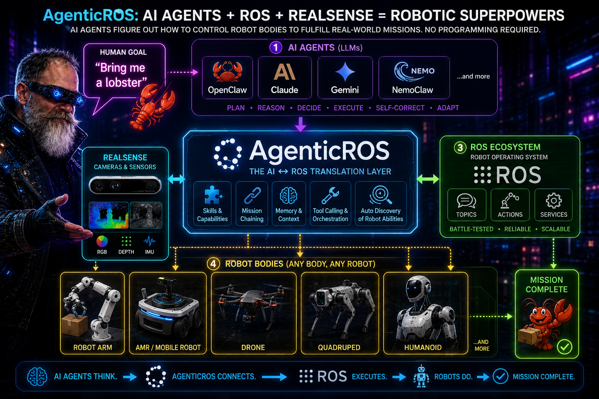
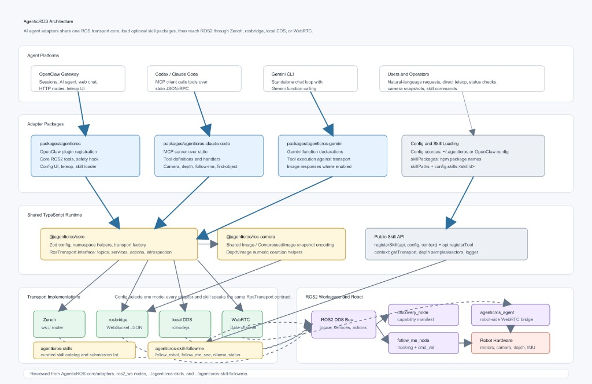

# AgenticROS

```text
    _                     _   _       ____   ___  ____
   / \   __ _  ___ _ __ | |_(_) ___ |  _ \ / _ \/ ___|
  / _ \ / _` |/ _ \ '_ \| __| |/ __|| |_) | | | \___ \
 / ___ \ (_| |  __/ | | | |_| | (__ |  _ <| |_| |___) |
/_/   \_\__, |\___|_| |_|\__|_|\___||_| \_\___/|____/
        |___/
  AgenticROS - agentic AI for ROS-powered robots
```

**Physical AI Agents for ROS Robots**



[](https://www.youtube.com/watch?v=_fbWhYcPj0M)

> ▶ [Watch the AgenticROS intro on YouTube](https://www.youtube.com/watch?v=_fbWhYcPj0M)

AgenticROS turns ROS 2 robots into agent-native machines. Speak, type, or message — and your robot perceives, reasons, and acts. It is an open, AI-agent-agnostic interface layer that bridges the world of frontier reasoning models with the world of cameras, depth sensors, motors, and `cmd_vel`, so robots stop being remote-controlled tools and start collaborating like teammates.

With AgenticROS, your robot can describe what it sees, follow intent ("go check the front door"), run skills you author, and respond to natural language across the agent platforms you already use. **One ROS 2 workspace, one config, many agents.**

## Supported AI Agent platforms

- **[OpenClaw](https://openclaw.ai)** — Native gateway plugin with ROS 2 tools, commands, a config UI, a teleop web app, and a skill loader. The flagship integration.
- **[NVIDIA NemoClaw](https://github.com/NVIDIA/NemoClaw)** — Run AgenticROS inside NemoClaw's OpenShell sandbox with policy-enforced egress and managed NVIDIA inference; ROS 2, RealSense, and rosbridge stay on the host while the plugin runs sandboxed.
- **[Anthropic Claude](https://www.anthropic.com/claude)** — A single MCP server powers **Claude Code** (terminal), **Claude Desktop** (macOS / Windows), and **Claude Dispatch** (iOS, paired to your Mac). Ask Claude what your robot sees, and it answers with a live camera snapshot and depth reading.
- **[OpenAI Codex CLI](https://developers.openai.com/codex/)** — Same MCP server as Claude Code. One command registers Codex: `agenticros codex setup` (writes `~/.codex/config.toml` with an absolute path to the MCP binary). Full tool surface: missions, follow-me, find-object, memory. Setup guide: [docs/codex-setup.md](docs/codex-setup.md).
- **[Hermes Agent](https://github.com/NousResearch/hermes-agent)** — Model-agnostic agent gateway (OpenRouter, Ollama, 200+ providers) with MCP client support. Same MCP server as Codex: `agenticros hermes setup` writes `~/.hermes/config.yaml`. Setup guide: [docs/hermes-setup.md](docs/hermes-setup.md).
- **[Google Gemini](https://ai.google.dev/)** — Standalone CLI that uses Gemini function calling against the same ROS 2 tools (no MCP required) — ideal for scripting and headless agents.

AgenticROS is built so that new adapters (LangGraph, OpenAI, local models, voice stacks, etc.) can be added without touching the ROS 2 layer. The core transport and tool contract are platform-agnostic; adapters are thin shims that surface those tools to each agent runtime.

## Local VLM (Ollama) — no cloud API required

Control your robot with a **local vision-language model** instead of OpenAI or other cloud APIs. AgenticROS robot tools work the same; you point **OpenClaw** or **Hermes** at Ollama on your machine.

```bash
ollama pull qwen3-vl:8b-instruct   # recommended: chat + tools + camera vision
# or: ollama pull qwen3-vl:2b     # smaller hardware

npx agenticros init               # skip the OpenAI key step when prompted
# Configure OpenClaw to use Ollama as primary model (see guide below)
agenticros up sim-amr             # or: agenticros up real
```

Then chat in OpenClaw web UI or Hermes: *"List ROS topics"*, *"drive forward slowly"*, *"what do you see?"*

| Path | Best for |
|------|----------|
| **OpenClaw + Ollama** | Web chat, teleop, messaging channels, skills |
| **Hermes + Ollama** | Terminal agent with any Ollama model |
| **NemoClaw + Ollama** | Sandboxed Jetson / edge (see [docs/nemoclaw.md](docs/nemoclaw.md)) |

**Full setup, model picks, multimodal catalog patches, describer, Follow Me VLM, and troubleshooting:** **[docs/local-vlm.md](docs/local-vlm.md)**

## Architecture



- **Core** (`packages/core`): Platform-agnostic ROS2 transport (rosbridge, Zenoh, local, WebRTC), config schema, and shared types. No dependency on any specific AI platform.
- **Adapters** (`packages/agenticros`, and later others): Implement the contract for each AI platform. The OpenClaw adapter registers tools, commands, and HTTP routes with the OpenClaw gateway and uses the core for all ROS2 communication.
- `**packages/agenticros-claude-code`** — MCP server for **Claude Code**, **Claude desktop**, **Dispatch**, **OpenAI Codex CLI**, and **Hermes Agent**. See [packages/agenticros-claude-code/README.md](packages/agenticros-claude-code/README.md), [docs/codex-setup.md](docs/codex-setup.md), and [docs/hermes-setup.md](docs/hermes-setup.md).
- `**packages/agenticros-gemini`** — **Gemini CLI**: use Google Gemini to chat with your robot from the terminal (same ROS2 tools, no MCP). See [packages/agenticros-gemini/README.md](packages/agenticros-gemini/README.md).

```
User (messaging app) → OpenClaw Gateway → AgenticROS OpenClaw plugin → Core → ROS2 robots
Claude (Code / desktop / Dispatch) → agenticros MCP server → Core → ROS2 robots (Zenoh/rosbridge)
Codex CLI → agenticros MCP server → Core → ROS2 robots (Zenoh/rosbridge)
Hermes Agent → agenticros MCP server → Core → ROS2 robots (Zenoh/rosbridge)
Gemini CLI → @agenticros/gemini (function calling) → Core → ROS2 robots
```

## A shared mission language for robots

The same tool surface across every adapter — Claude Code, Codex, Gemini, OpenClaw — so two different agents on two different stacks can both speak the same dialect when controlling the same robot. Built around five capabilities.

### Capability manifests — robots advertise *verbs*

Every AgenticROS-enabled robot exposes a typed list of named verbs through `ros2_list_capabilities`: `drive_base`, `take_snapshot`, `measure_depth`, `find_object`, `follow_person`, plus whatever a [skill package](#skills) contributes. The agent plans against the verbs instead of raw ROS 2 topics — and the manifest is shaped to double as an ACP / A2A agent card.

### Mission chaining — `run_mission`

One MCP tool, `run_mission`, executes a declarative step graph. Each step is `{ id, capability, inputs, on_fail }`. Outputs from any step flow into later steps via `{{stepId.outputs.field}}` template references — so a detection wires straight into the next motion command with no glue code:

```json
{
  "steps": [
    { "id": "find",     "capability": "find_object", "inputs": { "target": "chair" } },
    { "id": "approach", "capability": "drive_base",
      "inputs": {
        "linear_x": 0.2,
        "angular_z": "{{find.outputs.horizontal_offset}}"
      }
    }
  ]
}
```

### Natural-language goals

`run_mission` also accepts a `goal` field — plain English. A rule-based, deterministic planner in `@agenticros/core` compiles it into a runnable mission against the robot's capability registry:

- `"take a picture"` → `take_snapshot`
- `"follow me"` → `follow_person`
- `"drive forward at 0.3 m/s"` → `drive_base { linear_x: 0.3 }`
- `"find a chair and drive toward it"` → the two-step compound plan above

No LLM dependency (the planner is a few hundred lines of pattern matching, so the runtime doesn't require Ollama) and no fabricated calls (it only emits capabilities actually in the registry). Uncompilable goals return a clean error with the recognised-verb list so the agent can self-correct.

### Multi-robot fleets

`ros2_list_robots`, `ros2_discover_robots`, and `ros2_find_robots_for({ capability, kind?, online? })` let an agent ask *"give me an AMR that can `follow_person` and is currently online"* and get back a ranked list. The CLI keeps fleet metadata in sync without hand-editing JSON:

```bash
agenticros robots add my-amr \
  --kind=amr --sensors=has_realsense,!has_arm \
  --capabilities=drive_base,take_snapshot,follow_person
```

On the ROS side, every robot publishes a 1 Hz heartbeat on `<ns>/agenticros/robot_info` so the online filter reflects what's actually reachable. A single mission can route different steps to different robots — *"the AMR finds the box, the arm picks it up"* runs as one mission.

### Cancel + shared transcripts

`mission_cancel({ mission_id })` flips an in-process cancellation token; the runner stops at the next step boundary and marks remaining steps `cancelled`. When the [shared memory backend](#memory-optional) is on, every step is also written to `mission:<id>` in long-term memory, tagged with `step:<status>` and `capability:<id>`. A different agent — different process, different vendor — can `memory_recall` later and reconstruct exactly what happened, so two agents can collaborate on or hand off a mission.

**How-to:** step-by-step fleet setup, declarative plans, NL goals, cancel, and handoff — **[docs/missions.md](docs/missions.md)**. Runnable walkthrough: **[examples/find-and-approach/README.md](examples/find-and-approach/README.md)**.

Full architecture + design trade-offs: **[docs/strategy-ai-agents-plus-ros.md](docs/strategy-ai-agents-plus-ros.md)**.

## Repository layout

- `**packages/core**` — Transport, types, config (Zod). Used by all adapters.
- `**packages/agenticros**` — OpenClaw plugin: tools, commands, config page, teleop routes.
- `**packages/agenticros-claude-code**` — MCP server for Claude Code + Claude desktop / Dispatch (tools only; no config UI).
- `**packages/agenticros-gemini**` — Gemini CLI (function calling; no MCP).
- `**ros2_ws/**` — ROS2 workspace: `agenticros_msgs`, `agenticros_bringup` (Gazebo + RViz + rosbridge launches), `agenticros_discovery`, `agenticros_agent`, `agenticros_follow_me`.
- `**docs/**` — Architecture, skills, robot setup, Zenoh, teleop, **[local VLM / Ollama](docs/local-vlm.md)**.
- `**scripts/**` — Workspace setup, gateway plugin config, run demos.
- `**docker/**` — Docker Compose and Dockerfiles for ROS2 + plugin images.
- `**examples/**` — Example projects.

## Install

You only need one command. The `agenticros` CLI handles everything else —
installing the ROS 2 workspace, building the MCP server, registering the
OpenClaw plugin, and wiring up your robot config.

```bash
npx agenticros
```

That's it. Run it on any machine with **Node ≥ 20**, no `git clone` required.
The first run launches the interactive menu:

```text
╔──────────────────────────────────────────────────╗
║  AgenticROS - agentic AI for ROS-powered robots  ║
╚──────────────────────────────────────────────────╝

? What would you like to do?
  Launch with real robot
❯ Launch with simulation
  First-time setup (workspace + OpenClaw plugin + Codex MCP + optional API key)
  Manage skills (2 registered, 0 available, 0 broken)
  Stop everything
  Doctor (health check)
  Configure (API keys, namespace, transport)
  Tail logs
```

Pick **First-time setup** once (workspace + OpenClaw plugin + optional Codex MCP + optional API key, all
idempotent). **Using local Ollama instead of OpenAI?** Skip the API key step — see **[Local VLM (Ollama)](#local-vlm-ollama--no-cloud-api-required)**. Then choose how you want to run:

| You want to … | Pick |
|---|---|
| Drive your **real robot** (RealSense + motors + MCP) | **Launch with real robot** |
| Demo a **simulated 2-wheel AMR** in Gazebo + RViz | **Launch with simulation → AMR** |
| Demo a **simulated 6-DOF arm** (UR5e-shaped, per-joint position control) | **Launch with simulation → 6-DOF arm** |

Once a stack is up, point any of the supported agents — OpenClaw, Claude Code,
OpenAI Codex, Hermes Agent, Claude Desktop / Dispatch, or Gemini CLI — at the same robot and start talking
to it. The CLI tracks what it spawned (pidfiles + logs under `/tmp/agenticros-*`),
so **Stop everything** cleanly tears the demo down.

Prefer scripted invocations? Every menu item maps to a direct command:

```bash
npx agenticros init             # one-time workspace + plugin + Codex/Hermes MCP (+ optional API key)
agenticros codex setup          # register AgenticROS MCP for OpenAI Codex CLI
agenticros codex doctor         # validate ~/.codex/config.toml
agenticros hermes setup         # register AgenticROS MCP for Hermes Agent
agenticros hermes doctor        # validate ~/.hermes/config.yaml
agenticros up real              # real robot stack
agenticros up sim-amr           # simulated AMR (Gazebo + RViz, headless on Jetson)
agenticros up sim-arm           # simulated 6-DOF arm
agenticros mode <real|sim>      # swap the active config profile (namespace, transport)
agenticros robots               # list / add / remove robots in the fleet (kind, sensors, capabilities)
agenticros skills               # list / add / remove AgenticROS skills (see below)
agenticros doctor               # coloured health check
agenticros down                 # stop everything we started
```

Full CLI reference: **[packages/agenticros-cli/README.md](packages/agenticros-cli/README.md)**.

### Requirements

- **Node.js ≥ 20** (the only hard requirement — `npx agenticros` installs pnpm
  itself if missing)
- **ROS 2 Humble or Jazzy** if you plan to use the real-robot stack or any
  simulation (the CLI sources `/opt/ros/<distro>/setup.bash` and runs
  `colcon build` for you)
- **OpenClaw gateway** only if you also want the OpenClaw web UI / chat /
  teleop adapter

### Contributing / building from source

Hacking on the packages themselves? Clone and use the local checkout — the CLI
auto-detects the workspace and uses live sources instead of the bundled snapshot:

```bash
git clone https://github.com/PlaiPin/agenticros && cd agenticros
pnpm install && pnpm build
./agenticros                    # repo-local CLI shim, same menu as `npx agenticros`
```

For the OpenClaw plugin specifically, point the gateway at this repo's
`packages/agenticros` and configure under `plugins.entries.agenticros.config`.
**Recommended:** OpenClaw **2026.3.11+** — routes work at
[http://127.0.0.1:18789/plugins/agenticros/](http://127.0.0.1:18789/plugins/agenticros/)
(config, teleop). For local dev without token auth:
`node scripts/setup-openclaw-local.cjs` then restart the gateway. Older gateways
needing token auth: run `node scripts/agenticros-proxy.cjs 18790` and open
[http://127.0.0.1:18790/plugins/agenticros/](http://127.0.0.1:18790/plugins/agenticros/).
See **[docs/openclaw-releases-and-plugin-routes.md](docs/openclaw-releases-and-plugin-routes.md)**
and **[docs/teleop.md](docs/teleop.md)**.

See **`docs/`** for robot setup, **[missions](docs/missions.md)**, skills, teleop, simulation internals, and Docker.

## RViz2 and Gazebo (TurtleBot3 + rosbridge)

The package `**agenticros_bringup`** provides launch files and an RViz2 config so you can run the same style of stack used in `**examples/turtlebot-chat**` and `**docker/**`: TurtleBot3 in Gazebo, `**/scan**`, `**/cmd_vel**`, and rosbridge on **port 9090** for the AgenticROS plugin.

**Install** (Ubuntu / ROS 2 Jazzy): `sudo apt install ros-jazzy-turtlebot3-gazebo ros-jazzy-rviz2 ros-jazzy-rosbridge-suite` (or rely on the Docker image, which already includes them). `**colcon build` does not install this** — if you see `package 'turtlebot3_gazebo' not found`, run the `apt` line above, then verify with `ros2 pkg prefix turtlebot3_gazebo` after sourcing `/opt/ros/jazzy/setup.bash`.

For **namespaced** `cmd_vel` (same `robot.namespace` as the plugin in OpenClaw), pass `**robot_namespace:=<id>`** to the Gazebo bringup launches, or see [agenticros_bringup README](ros2_ws/src/agenticros_bringup/README.md#namespaced-cmd_vel-agenticros-robotnamespace).

**Build** the workspace package (from `**ros2_ws`** after a full `colcon build`, or alone):

```bash
cd ros2_ws
source /opt/ros/jazzy/setup.bash
colcon build --packages-select agenticros_bringup
source install/setup.bash
```

**Commands** (after `source install/setup.bash`):


| Goal                                                                          | Command                                                            |
| ----------------------------------------------------------------------------- | ------------------------------------------------------------------ |
| **Rosbridge + Gazebo** (headless-friendly; plugin uses `ws://localhost:9090`) | `ros2 launch agenticros_bringup rosbridge_gazebo.launch.py`        |
| **Gazebo + RViz** on one machine (needs a display)                            | `ros2 launch agenticros_bringup turtlebot3_gazebo_rviz.launch.py`  |
| **RViz only** (simulation already running)                                    | `ros2 launch agenticros_bringup rviz.launch.py use_sim_time:=true` |
| **Gazebo only** (you start rosbridge yourself)                                | `ros2 launch agenticros_bringup gazebo_turtlebot3.launch.py`       |


**Parameters**: e.g. `turtlebot3_model:=waffle`, or `rviz_config:=/path/to/custom.rviz` for the RViz launch.

**Mode A (local DDS)** — OpenClaw and Gazebo on the **same machine**, plugin transport `**local`** (no rosbridge). Match `**ROS_DOMAIN_ID`** between the sim and the plugin (default `**0**`):

```bash
ros2 launch agenticros_bringup mode_a_gazebo.launch.py
# With RViz: ros2 launch agenticros_bringup mode_a_gazebo_rviz.launch.py
```

In the AgenticROS config UI, set **Transport mode** to **local** and **Domain ID** to the same value as `ros_domain_id` (default `0`). Then drive the robot with the usual tools (e.g. `ros2_publish` on `/cmd_vel`).

**Docker** (starts Gazebo + TurtleBot3 + rosbridge — typical for **Mode B** plugin on host → `ws://localhost:9090`):

```bash
cd docker
docker compose -f docker-compose.yml -f docker-compose.sim.yml up ros2
```

Then configure the AgenticROS plugin with `**ws://localhost:9090**` as usual. The bundled RViz config is `**turtlebot3_agenticros.rviz**` (fixed frame `**odom**`, LaserScan `**/scan**`, RobotModel from `**/robot_description**`). Adjust displays in RViz if your robot uses different topic names.

Details: [ros2_ws/src/agenticros_bringup/README.md](ros2_ws/src/agenticros_bringup/README.md).

## Running AgenticROS on NemoClaw

[NVIDIA NemoClaw](https://github.com/NVIDIA/NemoClaw) packages OpenClaw inside an OpenShell sandbox container with policy-enforced egress and managed inference. AgenticROS plugs into that OpenClaw the same way it plugs into a "vanilla" gateway — with one twist: ROS 2, RealSense, and rosbridge run on the **host**, and only the AgenticROS plugin runs **inside** the sandbox. The plugin reaches the host over the Docker bridge at `host.docker.internal:9090`.

Quick steps (sandbox named `nemo`, robot has namespace `<NS>`):

```bash
# 1. Build + pack the plugin so it works in the sandbox's offline-npm env
pnpm install && pnpm build
pnpm --filter @agenticros/agenticros deploy --prod /tmp/agenticros-deploy
rm -f /tmp/agenticros-deploy/node_modules/.pnpm/node_modules/@agenticros/agenticros

# 2. Copy it into the sandbox and chown to the sandbox user
CONTAINER=$(docker ps --format '{{.Names}}' | grep '^openshell-nemo-')
docker exec "$CONTAINER" rm -rf /sandbox/agenticros && docker exec "$CONTAINER" mkdir -p /sandbox/agenticros
docker cp /tmp/agenticros-deploy/. "$CONTAINER:/sandbox/agenticros/"
docker exec "$CONTAINER" chown -R sandbox:sandbox /sandbox/agenticros

# 3. Register + configure the plugin inside the sandbox (HOME=/sandbox is required)
docker exec -u sandbox -e HOME=/sandbox "$CONTAINER" \
    openclaw plugins install -l /sandbox/agenticros           # Ctrl-C once it starts logging "ROS2 transport status:"

# 4. Open the host's rosbridge port in NemoClaw policy
nemoclaw nemo policy-add --from-file scripts/agenticros-rosbridge.policy.yaml --yes

# 5. Start RealSense + rosbridge on the host
./scripts/run_nemoclaw_host_stack.sh humble robot_namespace:=<NS> align_depth:=true

# 6. Restart the sandbox gateway, verify, and chat
nemoclaw nemo recover
./scripts/smoke_test_nemoclaw.sh        # 6 checks; exits 0 when all green
nemoclaw nemo dashboard-url
```

Full walkthrough, troubleshooting, and a "full-embed" alternative (ROS / RealSense baked into a custom sandbox image): **[docs/nemoclaw.md](docs/nemoclaw.md)**.

## Claude + AgenticROS (MCP)

The **AgenticROS MCP server** (`@agenticros/claude-code`) drives the robot from **Claude Code** (terminal) or from the **Claude desktop app** on macOS (including **Claude Dispatch** on iPhone when paired to Claude on your Mac). **OpenAI Codex CLI** uses the same server — see **[Codex + AgenticROS](#codex--agenticros-mcp)** below. Claude clients use **different config files** than Codex (`.mcp.json` / `claude_desktop_config.json` vs `.codex/config.toml`).

Shared MCP setup (Claude and Codex):

1. **Build** (from repo root): `pnpm install && pnpm build`
2. **AgenticROS config**: `~/.agenticros/config.json` — set `zenoh.routerEndpoint`, `robot.namespace`, `robot.cameraTopic`, etc. (see [packages/agenticros-claude-code/README.md](packages/agenticros-claude-code/README.md)).
3. **Zenoh**: Run `zenohd` with the remote-api plugin (e.g. port 10000) — see `scripts/zenohd-agenticros.json5` or [docs/zenoh-agenticros.md](docs/zenoh-agenticros.md).

Optional: override `robot.namespace` per MCP launch with env `**AGENTICROS_ROBOT_NAMESPACE`**. Prefer leaving it empty in MCP/Codex config so `agenticros mode real|sim` drives the active profile (see [docs/codex-setup.md](docs/codex-setup.md)).

### Claude Code CLI (terminal)

1. **Register MCP** (project scope, from repo root):
  ```bash
   claude mcp add --transport stdio --scope project agenticros -- node packages/agenticros-claude-code/dist/index.js
  ```
   Or add the server via `.mcp.json` in the repo. To avoid multiple MCP processes, run `pnpm mcp:kill` before starting a fresh `claude` session after rebuilding.
2. **Run**: `claude` — e.g. “List ROS2 topics”, “What do you see?”, “Publish a stop to cmd_vel.”

### Claude desktop app + Dispatch (iOS)

Claude Code stores MCP in `~/.claude.json` or project `.mcp.json`. The **Claude desktop app** uses a separate file:

- **macOS:** `~/Library/Application Support/Claude/claude_desktop_config.json`
- **Windows:** `%APPDATA%\Claude\claude_desktop_config.json`

1. Copy your **agenticros** MCP entry from Claude Code / `.mcp.json` into `mcpServers` in `claude_desktop_config.json`.
2. Use an **absolute path** to `packages/agenticros-claude-code/dist/index.js` (the desktop app’s working directory is not your repo root, so relative `node packages/...` paths will fail).
3. **Fully quit** the Claude desktop app (not just close the window) and reopen it. The **agenticros** tools should appear in the desktop app and in **Dispatch** when your phone is paired to Claude on the Mac.

Example `mcpServers` entry (adjust the path and namespace to your machine):

```json
{
  "mcpServers": {
    "agenticros": {
      "command": "sh",
      "args": [
        "-c",
        "node /ABSOLUTE/PATH/TO/agenticros/packages/agenticros-claude-code/dist/index.js 2>>/tmp/agenticros-mcp.log"
      ],
      "env": {
        "AGENTICROS_ROBOT_NAMESPACE": "robotYOUR_NAMESPACE_NO_DASHES"
      }
    }
  }
}
```

Full steps, permissions (`mcp__agenticros`), and troubleshooting are in **[packages/agenticros-claude-code/README.md](packages/agenticros-claude-code/README.md)**.

## Codex + AgenticROS (MCP)

**OpenAI Codex CLI** is a standard MCP client — it uses the same `@agenticros/claude-code` server as Claude Code (missions, follow-me, find-object, memory, full ROS tool surface). No separate adapter package.

### Quick setup

```bash
pnpm install && pnpm build          # or: npx agenticros init
agenticros codex setup              # ~/.codex/config.toml (global)
agenticros codex setup --project    # .codex/config.toml in repo root
agenticros codex doctor             # validate absolute MCP path + namespace policy
```

Start Codex in your project directory, run `/mcp` — you should see **agenticros** connected with the full tool list. Then ask e.g. “List ROS2 topics” or “What do you see?”

### Config files

| File | Scope |
|------|--------|
| `~/.codex/config.toml` | Global — all Codex sessions |
| `<project>/.codex/config.toml` | Project — when Codex runs in that directory |

`agenticros codex setup` writes an **absolute path** to `packages/agenticros-claude-code/dist/index.js` (or the bundled MCP path after `npx agenticros init`). Relative paths fail because Codex does not spawn MCP servers from the repo root.

Leave `AGENTICROS_ROBOT_NAMESPACE = ""` in the Codex env block so `~/.agenticros/config.json` and `agenticros mode real|sim` drive the active robot (same policy as `.mcp.json`).

### Manual registration

```bash
codex mcp add agenticros -- node "$(pwd)/packages/agenticros-claude-code/dist/index.js"
```

Use an absolute path if not run from the repo root.

### Troubleshooting

- **`/mcp` does not list agenticros** → run `agenticros codex setup`; check `agenticros codex doctor`
- **Transport timeout** → bring up Zenoh/rosbridge or run `agenticros up sim-amr` / `agenticros up real`
- **Logs** → `/tmp/agenticros-mcp.log`

Full guide: **[docs/codex-setup.md](docs/codex-setup.md)**.

## Hermes + AgenticROS (MCP)

**[Hermes Agent](https://github.com/NousResearch/hermes-agent)** is a model-agnostic MCP client — it uses the same `@agenticros/claude-code` server as Claude Code and Codex (missions, follow-me, find-object, memory, full ROS tool surface). No separate adapter package. Works with OpenRouter, Ollama, Anthropic, OpenAI, and 200+ other providers.

### Quick setup

```bash
pnpm install && pnpm build          # or: npx agenticros init
agenticros hermes setup             # ~/.hermes/config.yaml
agenticros hermes doctor            # validate absolute MCP path + namespace policy
```

In Hermes, run `/reload-mcp` or restart, then `hermes mcp test agenticros`. Ask e.g. “List ROS2 topics” or “What do you see?”

### Config file

| File | Scope |
|------|--------|
| `~/.hermes/config.yaml` | Global — default Hermes profile |

`agenticros hermes setup` writes an **absolute path** to the MCP server and leaves `AGENTICROS_ROBOT_NAMESPACE: ""` so `agenticros mode real|sim` drives the active robot (same policy as Codex).

### Troubleshooting

- **MCP tools missing** → run `agenticros hermes setup`; `/reload-mcp` in Hermes; check `agenticros hermes doctor`
- **Transport timeout** → bring up Zenoh/rosbridge or run `agenticros up sim-amr` / `agenticros up real`

Full guide: **[docs/hermes-setup.md](docs/hermes-setup.md)**.

## Gemini CLI

Use **Google Gemini** to chat with your robot from the terminal (same ROS2 tools as Claude Code, no MCP).

1. **Build**: `pnpm install && pnpm build`
2. **Config**: Same as Claude Code — `~/.agenticros/config.json` with `zenoh.routerEndpoint`, `robot.namespace`, etc.
3. **Run**: Set `GEMINI_API_KEY` (or `GOOGLE_API_KEY`) and run:
  ```bash
   GEMINI_API_KEY=xxx pnpm --filter @agenticros/gemini exec agenticros-gemini "What do you see?"
  ```

See **[packages/agenticros-gemini/README.md](packages/agenticros-gemini/README.md)** for details and tested command examples (camera snapshot/description, depth distance, forward Twist, and stop).

## Memory (optional)

AgenticROS can give every adapter a **shared, persistent, cross-process** long-term memory so facts you teach the robot from one agent are immediately available in the others — Claude Desktop, Claude Code, OpenAI Codex, Hermes Agent, Gemini CLI, OpenClaw chat. Off by default. Two backends:

- **`local`** — zero deps, JSON-on-disk at `~/.agenticros/memory.json`, keyword + recency search. Enable with one config flag.
- **`mem0`** — semantic search via the pure-Node [`mem0ai`](https://www.npmjs.com/package/mem0ai) package (`pnpm add mem0ai`); file-backed vector store at `~/.mem0/vector_store.db` (shared across all processes on the host, no server to run); embedder auto-detects Ollama (`http://localhost:11434`) → `OPENAI_API_KEY` → clear error.

When enabled, every adapter exposes four tools — `memory_remember`, `memory_recall`, `memory_forget`, `memory_status`. OpenClaw chats additionally get a system-context section that lists recently-remembered facts and instructs the LLM to call `memory_recall` before answering personal-context questions like *"what do I have for X?"* or *"what's my Y?"*.

Memory is namespaced by `robot.namespace` so adapters talking to the same robot share the same store. See **[docs/memory.md](docs/memory.md)** for ready-to-paste recipes, cross-process verification steps, and troubleshooting. OpenClaw users can also enable it from the web config UI at `/agenticros/config` (Memory section).

Quickest path to try it (fully local, no API keys):

```bash
pnpm add mem0ai
ollama pull nomic-embed-text   # ~270 MB embedder model
```

Add `{ "memory": { "enabled": true, "backend": "mem0" } }` to `~/.agenticros/config.json` (or the OpenClaw config UI). Restart the gateway / MCP client. Then ask Claude Desktop *"remember that I have a RealSense D435i for eyes"* and ask Codex or OpenClaw *"what do I have for eyes?"* — same fact, every agent.

## Skills

AgenticROS **skills** are optional packages that add tools and behaviors to the plugin (e.g. `follow_person`, `find_object`). They are loaded at OpenClaw gateway start. Browse and install from **[skills.agenticros.com](https://skills.agenticros.com)**, or scaffold and publish your own with the CLI.

### Managing skills with the CLI

The `agenticros skills` command (and the **Manage skills** menu entry) does everything for you: it scans the usual locations for clones, edits `~/.openclaw/openclaw.json`, refreshes the plugin manifest's `contracts.tools` allowlist, and reminds you to bounce the gateway.

```bash
# Install from the marketplace (owner/skill-id ref)
npx agenticros skills search follow
npx agenticros skills install chrismatthieu/followme

agenticros skills                       # list registered + cloned-but-unregistered
agenticros skills discover              # interactive picker over candidates on disk
agenticros skills add <path-or-name>    # register a clone (path) or npm package
agenticros skills remove <id-or-name>   # unregister
agenticros skills sync                  # refresh OpenClaw contracts.tools allowlist
```

**Create and publish** a new skill:

```bash
npx agenticros create-skill my-skill --template robot
cd agenticros-skill-my-skill && npm install && npm run dev
npx agenticros publish
```

A typical manual install (without the marketplace) looks like:

```bash
# clone whichever skills you want, anywhere near the repo
cd ~/Projects
git clone https://github.com/agenticros/agenticros-skill-followme
git clone https://github.com/agenticros/agenticros-skill-find

# build them (skills compile independently of the main workspace)
cd agenticros-skill-followme && pnpm install && pnpm build && cd ..
cd agenticros-skill-find     && pnpm install && pnpm build && cd ..

# register both — short ids resolve against the discovered clones
agenticros skills add followme
agenticros skills add find
agenticros skills sync                  # update contracts.tools
systemctl --user restart openclaw-gateway.service
```

`agenticros skills` then shows them as registered, and `agenticros doctor` includes a skills health-check that flags any clone that hasn't been built or whose `skillPaths` entry no longer exists.

Listing output:

```text
╔─────────────────────╗
║  AgenticROS skills  ║
╚─────────────────────╝

› OpenClaw config: /home/you/.openclaw/openclaw.json

Registered:
  ● followme  agenticros-skill-followme
      via path  →  /home/you/Projects/agenticros-skill-followme
  ● find      agenticros-skill-find
      via path  →  /home/you/Projects/agenticros-skill-find
```

### What the CLI writes

- `~/.openclaw/openclaw.json` → `plugins.entries.agenticros.config.skillPaths[]` and `.skillPackages[]` (the only place the plugin actually reads from at gateway start).
- `packages/agenticros/openclaw.plugin.json` → `contracts.tools` allowlist via `scripts/sync-skill-tools.mjs`. Required on OpenClaw **2026+**, which silently drops any tool a plugin registers but hasn't declared.

Per-skill behaviour lives under `config.skills.<skillId>` (e.g. `config.skills.followme.depthTopic`). The CLI doesn't auto-write these — use `agenticros config set skills.find.confidence=0.5` or edit `~/.openclaw/openclaw.json` directly. See each skill's README for its options.

### Contract & writing your own skill

A skill is a Node package with an `"agenticros": { "id": "..." }` block in `package.json` and a `registerSkill(api, config, context)` export from `main`. Scaffold with `npx agenticros create-skill`, publish to **[skills.agenticros.com](https://skills.agenticros.com)** with `npx agenticros publish`, and install with `npx agenticros skills install <owner/skill-id>` (e.g. `chrismatthieu/followme`). See **[docs/skills.md](docs/skills.md)** for the full contract and **[agenticros-skill-followme](https://github.com/agenticros/agenticros-skill-followme)** ([marketplace listing](https://skills.agenticros.com/chrismatthieu/followme)) as a reference template.

## Strategy & vision

Where AgenticROS is going next — beyond the shared mission language above, the roadmap covers turning capability manifests into agent cards on the wire (WebRTC / A2A so a robot can register itself as an agent in a mesh), an LLM-backed planner behind the existing `compileGoalToMission` contract, the `skills.agenticros.com` marketplace with declarative auto-fetch and in-agent installs, spatial memory, and cross-vendor agent collaboration via ACP / A2A: **[docs/strategy-ai-agents-plus-ros.md](docs/strategy-ai-agents-plus-ros.md)**.

## License

Apache-2.0
